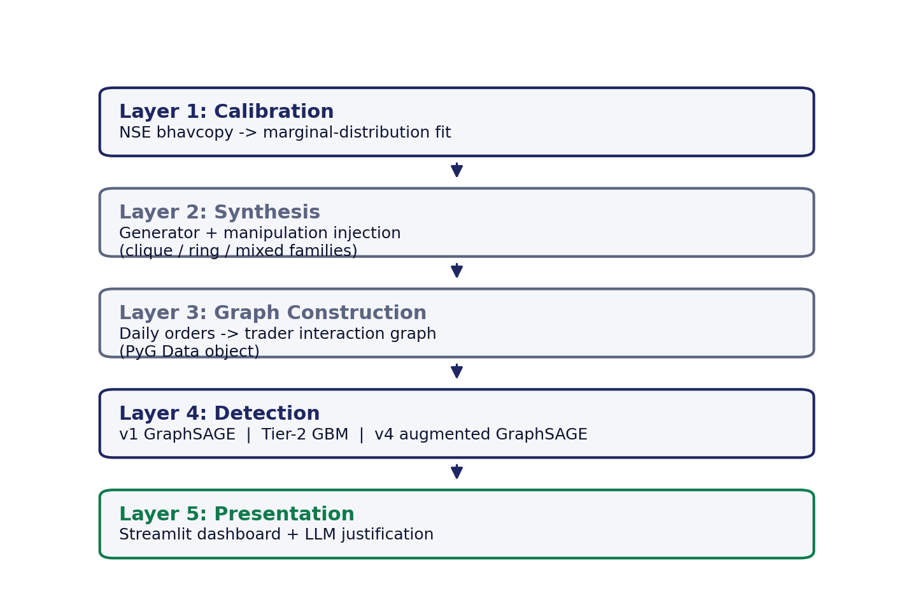
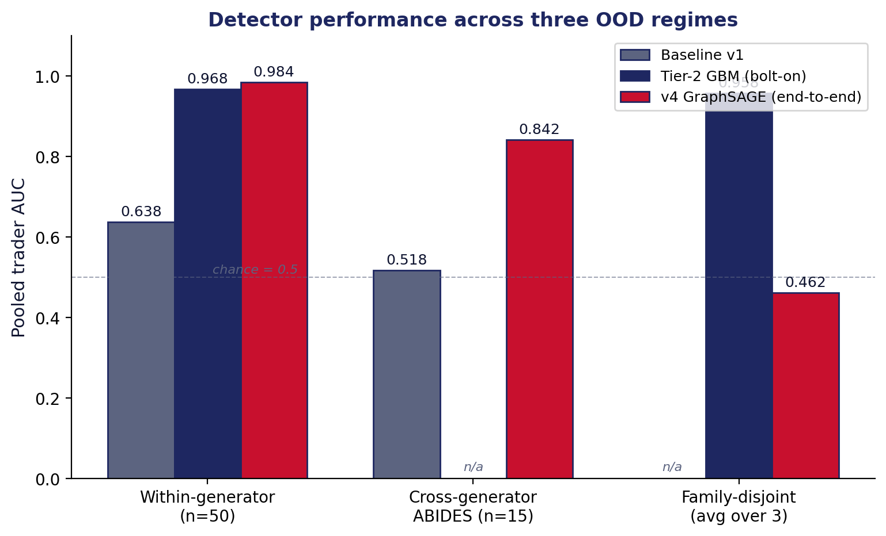
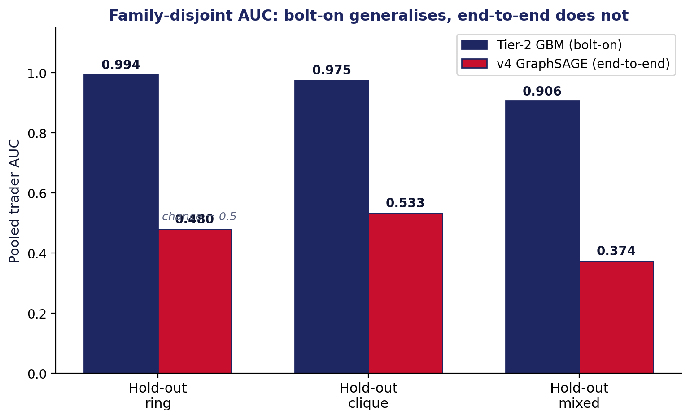

# market-survinsp-ally

[](https://doi.org/10.5281/zenodo.21755230)
[](https://opensource.org/licenses/MIT)
[](https://github.com/sumitsontakke/market-survinsp-ally/actions/workflows/test.yml)

**A research toolkit for detecting collusive market manipulation with graph neural networks.**

> `market-survinsp-ally` = *market surveillance & inspection ally*. A companion tool for a human surveillance analyst, not a replacement.

<p align="center">
  
</p>

Two independent modules with a clean on-disk boundary:

- **[`synth/`](synth/)** — NSE-calibrated synthetic market data generator with ABIDES integration. Produces cohorts of trading days with configurable clique, ring, and mixed manipulation families injected under known ground truth.
- **[`detect/`](detect/)** — Feature-augmented GraphSAGE detectors and a bolt-on Gradient Boosting Machine over six engineered manipulation-signature features. Includes a Streamlit investigator workbench.

Both modules exchange data through a strict [`SCHEMA.md`](SCHEMA.md) — never through Python imports. Either can be used standalone with any generator or detector that honours the schema.

---

## Headline results

Across three progressively harder out-of-distribution regimes:

| Test regime | Baseline v1 | Tier-2 GBM (bolt-on) | v4 GraphSAGE (end-to-end) |
|---|---:|---:|---:|
| Within-generator OOD (n=50) | AUC 0.638 | **AUC 0.968** | **AUC 0.984** |
| Cross-generator ABIDES (n=15) | AUC 0.518 (chance) | not run | **AUC 0.842** |
| Family-disjoint (leave-one-out) | — | **AUC 0.91 – 0.99** | AUC 0.37 – 0.53 |

The full architectural finding — *bolt-on beats end-to-end on family shift* — is developed in the two accompanying papers.

---

## Papers

Two complementary manuscripts written from the same research, framed for different reader communities:

1. **Feature-Augmented Graph Neural Networks for Out-of-Distribution Detection of Collusive Market Manipulation: A Multi-Cohort Study** — machine-learning / graph-learning framing. **Preprint, under journal review (Springer).** See [`docs/papers/model_journey_paper.pdf`](docs/papers/model_journey_paper.pdf).
2. **Trade Market Manipulation Detection with Graph Neural Networks: A Calibrated-Synthesis-to-Deployment Surveillance Pipeline** — RegTech / applied-AI framing. **Preprint, submission pending.** See [`docs/papers/model_journey_paper_v2.pdf`](docs/papers/model_journey_paper_v2.pdf).

Both are MTech dissertation-based work at PES University under Dr Milan Joshi's guidance. Neither has appeared in a peer-reviewed venue yet; both PDFs are working preprints and may evolve during review.

---

## Quick start

Reproduce the headline result on a small demo cohort in one command:

```bash
git clone https://github.com/sumitsontakke/market-survinsp-ally.git
cd market-survinsp-ally
make reproduce            # ~15 min on CPU, ~5 min with GPU
```

Under the hood `make reproduce` runs (exact commands, copy-pasteable):

```bash
pip install -e ./synth              # install the generator
pip install -e ./detect             # install the detectors
python -m synth generate  --config configs/synth/demo_cohort.yaml --out cohorts/demo
python -m synth validate  cohorts/demo
python -m detect features --cohort cohorts/demo
python -m detect train    --cohort cohorts/demo --model tier2
python -m detect evaluate --cohort cohorts/demo --model tier2
```

Deterministic outcome on any machine with Python 3.10+: **mean AUC 0.7292** across leave-one-run-out folds on the demo cohort. Full-scale paper cohorts (240 days × 50 runs) require GPU and take hours; see [`docs/REPRODUCE.md`](docs/REPRODUCE.md).

---

## Headline visualisation

The three-regime results in one chart — same numbers as the table above, showing where each detector stands across within-generator, cross-generator, and family-disjoint tests.

<p align="center">
  
</p>

The architectural finding — bolt-on tier-2 generalises across manipulation families held out at training time, while the end-to-end v4 network collapses:

<p align="center">
  
</p>

## Try the investigator dashboard

<p align="center">
  
</p>

```bash
docker compose -f detect/docker-compose.yml up webapp
open http://localhost:8505/Metric_Timeline
```

Landing pages of interest: `/Metric_Timeline` (model evolution + drift — shown above), `/Phase_G_Investigation` (per-trader deep dive with 3D subgraph + LLM justification), `/Demo_Review` (guided walk-through for a first-time viewer).

---

## Repository structure

```
market-survinsp-ally/
├── SCHEMA.md             ← the boundary contract (READ THIS FIRST if contributing)
├── README.md             ← you are here
├── LICENSE               ← MIT
├── CITATION.cff          ← "Cite this repository" metadata (Zenodo-linked)
├── Makefile              ← `make reproduce`, `make test`, `make lint`
│
├── synth/                ← Module 1: synthetic data generator
│   ├── README.md
│   ├── pyproject.toml    ← pip install -e ./synth
│   ├── src/synth/
│   │   ├── calibration/  ← NSE bhavcopy → marginal distributions
│   │   ├── generator/    ← calibrated synth engine
│   │   ├── abides/       ← ABIDES agents (Clique, Ring, FrontAccount)
│   │   ├── validate/     ← SCHEMA.md conformance checker
│   │   └── cli.py
│   └── tests/
│
├── detect/               ← Module 2: detectors + dashboard
│   ├── README.md
│   ├── pyproject.toml    ← pip install -e ./detect
│   ├── src/detect/
│   │   ├── features/     ← six engineered features (φ₁ … φ₆)
│   │   ├── models/       ← GraphSAGE v1, v4; Tier-2 GBM
│   │   ├── evaluation/   ← LOO-CV, family-disjoint, ABIDES eval
│   │   ├── dashboard/    ← Streamlit investigator workbench
│   │   └── cli.py
│   └── tests/
│
├── docs/
│   ├── REPRODUCE.md      ← full-cohort reproduction guide
│   ├── DEVELOPING.md     ← contributor guide
│   ├── papers/           ← preprint PDFs + LaTeX sources for both manuscripts
│   └── img/              ← README figures, dashboard screenshots
│
├── configs/              ← example generator + detector configs
├── cohorts/              ← .gitignored; small demo cohort tracked via git-lfs
└── .github/
    ├── workflows/        ← CI: pytest, lint, docker-build sanity
    └── ISSUE_TEMPLATE/
```

---

## What's *not* in this repository

By design, several artefacts live outside the repo:

- **Model checkpoints** — **not shipped in v0.2.0.** Trained weights will be archived on Zenodo (with SHA-256-verified downloads) starting v0.3.0. Until then, retrain from a cohort per [`docs/REPRODUCE.md`](docs/REPRODUCE.md); see [`docs/CHECKPOINTS.md`](docs/CHECKPOINTS.md) for the intended layout.
- **Full ABIDES cohort** — regenerated deterministically from `synth/`; the raw cohort is ~200 MB and not tracked.
- **Raw NSE bhavcopy data** — you plug in your own or use the fetcher in `synth/`.
- **Personal credentials, API tokens** — never.

A tiny 3-run demo cohort is generated on-the-fly by `make reproduce` (from `configs/synth/demo_cohort.yaml`), so nothing extra needs downloading on a fresh clone. Full-scale paper cohorts are regenerated deterministically from the same generator using larger configs.

---

## Contributing

We welcome contributors. Start with [`docs/DEVELOPING.md`](docs/DEVELOPING.md), then look for issues labelled [`good-first-issue`](https://github.com/sumitsontakke/market-survinsp-ally/labels/good-first-issue).

Community discussion happens in [GitHub Discussions](https://github.com/sumitsontakke/market-survinsp-ally/discussions). Long-form design notes belong in `docs/`.

Two rules for schema-touching contributions:

1. **Never add a required field without a schema major bump.** Optional fields with sane defaults are always welcome as minor bumps.
2. **Every schema change ships with a validator update** in `synth/src/synth/validate/`.

---

## Citation

If this work is useful to you, please cite the software (Zenodo DOI):

```bibtex
@software{sontakke2026msa,
  author    = {Sontakke, Sumit and Joshi, Milan},
  title     = {{market-survinsp-ally}: Graph-neural-network market surveillance toolkit for collusive-trading detection},
  year      = {2026},
  month     = aug,
  publisher = {Zenodo},
  version   = {v0.1.0},
  doi       = {10.5281/zenodo.21755230},
  url       = {https://doi.org/10.5281/zenodo.21755230}
}
```

The DOI `10.5281/zenodo.21755230` resolves to this specific v0.1.0 release. Each future release gets its own DOI; the "all versions" DOI on Zenodo always points to the latest.

The two associated manuscripts each have their own BibTeX entries in [`docs/papers/CITATIONS.md`](docs/papers/CITATIONS.md).

---

## License

MIT. See [`LICENSE`](LICENSE).

Dependencies retain their own licenses. ABIDES is BSD-3-Clause; PyTorch Geometric is MIT; scikit-learn is BSD-3-Clause; Streamlit is Apache-2.0.

---

## Acknowledgements

Developed as MTech dissertation work at the Department of Computer Science and Engineering, PES University, Bengaluru, under the guidance of Prof. Dr. Milan Joshi. Uses [ABIDES](https://github.com/abides-sim/abides) from JP Morgan AI Research as the cross-generator substrate.
